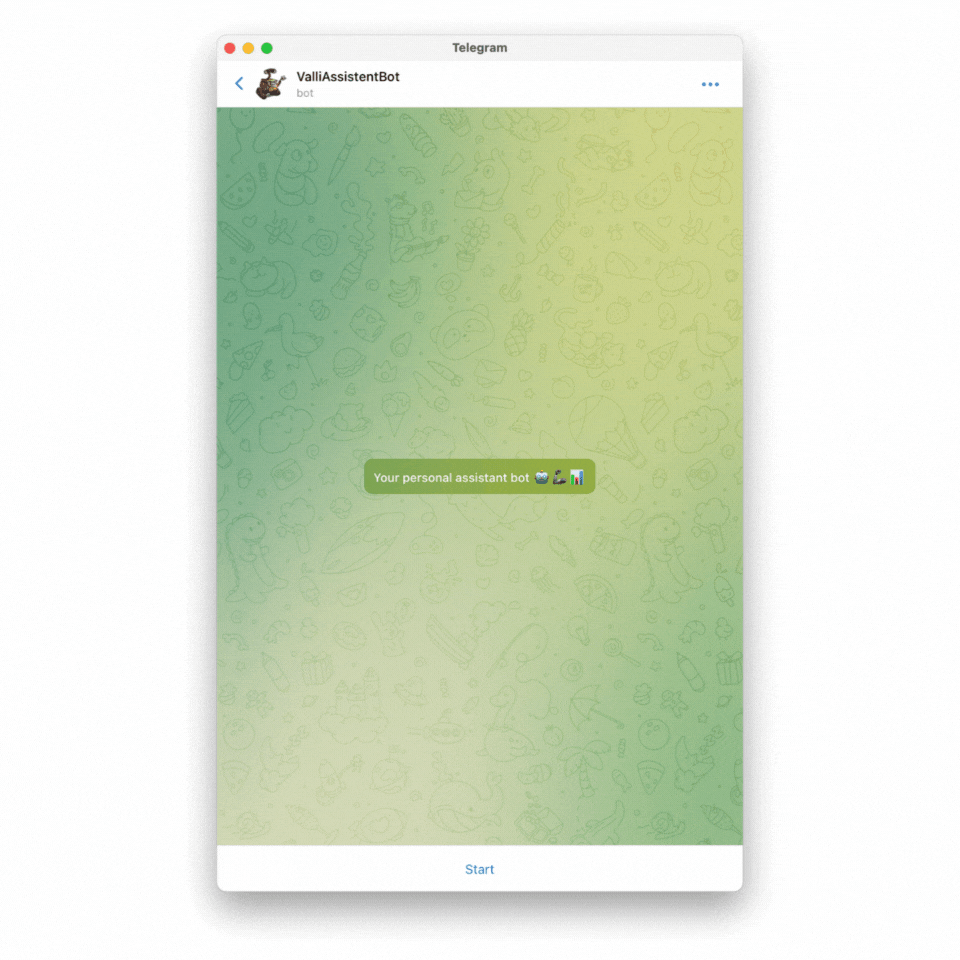

# Telegram-assistent


##  About this project
This bot helps to fix financial expenses on the basis of which it builds monthly reports.<br></br>
Main functions:
- accounting of income and expenses
- generating monthly reports


The vault is used for:
- storage of sensitive configuration parameters
- storage of financial expenses and income
- storing user authorization events

<p align="center">
  
</p>

##  Repository map
```sh
.
├── Dockerfile                ### Manifest for building docker-image
├── LICENSE                   ### License info
├── README.md                 ### The file you're reading now
├── CHANGELOG.md              ### All notable changes to this project will be documented in this file
├── bot.py                    ### Main file with code this project
├── docker-compose.yml        ### Manifest for building and running project with all dependencies
├── requirements.txt          ### List of python dependencies
└── doc                       ### Directory with content for documentation
    ├── bot-preview.gif         # Gif animation with a demonstration of the work of bots
─── src                       ### Extended modules
    ├── finance.py              # A code file containing a class and methods for processing the entered data and saving them to vault
    └── messages.py             # A code file containing a class and methods for generating beautiful messages with responses

2 directory, 9 files
```

##  Requirements
-  Vault server - [a storage of secrets for bot with kv v2 engine](https://developer.hashicorp.com/vault/docs/secrets/kv/kv-v2)
-  Telegram bot api token - [instructions for creating bot and getting a token of api](https://learn.microsoft.com/en-us/azure/bot-service/bot-service-channel-connect-telegram?view=azure-bot-service-4.0)

## Environment variables

| Variable  | Description | Default |
| ------------- | ------------- | ------------- |
| `BOT_VAULT_APPROLE_ID`  | [Approve-id created during vault setup](https://developer.hashicorp.com/vault/docs/auth/approle) | `not set` |
| `BOT_VAULT_APPROLE_SECRET_ID`  | [Approve-secret-id created during vault setup](https://developer.hashicorp.com/vault/docs/auth/approle) | `not set` |
| `BOT_VAULT_ADDR`  | The address at which the vault server will be available to the bot | `http://vault-server:8200` |
| `BOT_NAME` | The name of the bot | `telegram-assistent` |
| `BOT_VAULT_MOUNT_PATH` | The point of mounting secrets in the vault | `secretv2` |

##  How to run with docker-compose
1. Building and launching docker container with vault-server
```sh
docker-compose up -d vault-server
```

2. Configuration vault-server
```sh
# Go to the interactive shell of the vault container
docker exec -ti vault-server sh

# Init vault server
vault operator init

# Login in vault-server with root token
# ${VAULT_ROOT_TOKEN} - Root token for vault login. Substitute your own value instead of a variable. The root token was received in the output at the previous step
vault login ${VAULT_ROOT_TOKEN} -address=http://0.0.0.0:8200

# Enabling secret engine - kv version 2
vault secrets enable -version=2 -path=secretv2 kv

# Enabling auth with approle method
vault auth enable approle

### ${BOT_NAME} - your bot's name. Substitute your own value instead of a variable. For example: "telegram-assistent"

# Write policy rules to file in container
tee ${BOT_NAME}-policy.htl <<EOF
path "secretv2/config" {
  capabilities = ["create", "read", "update", "list"]
}
path "secretv2/data/${BOT_NAME}-config/config" {
  capabilities = ["read", "list"]
}
path "secretv2/data/${BOT_NAME}-data/*" {
  capabilities = ["create", "read", "update", "list"]
}
path "secretv2/metadata/${BOT_NAME}-data/*" {
  capabilities = ["read", "list"]
}
path "secretv2/data/${BOT_NAME}-login-events/*" {
  capabilities = ["create", "read", "update"]
}
EOF

# Creating policy for approle
vault policy write ${BOT_NAME}-policy ${BOT_NAME}-policy.htl

# Creating approle for bot
vault write auth/approle/role/${BOT_NAME}-approle role_name="${BOT_NAME}-approle" policies="${BOT_NAME}-policy" secret_id_num_uses=0 token_num_uses=0 token_type=default token_ttl=720h token_policies="${BOT_NAME}-policy" bind_secret_id=true token_no_default_policy=true

# Creating secret-id by approle (the secret-id received after executing the command will be required for the bot to work)
vault write auth/approle/role/${BOT_NAME}-approle/secret-id role_name="${BOT_NAME}-approle" metadata="bot=${BOT_NAME}"

# Reading role-id (the role-id received after executing the command will be required for the bot to work)
vault read auth/approle/role/${BOT_NAME}-approle/role-id
```

3. Loading the config for the bot (in the interactive shell of the vault container)
```sh
# Uploading the bot configuration containing sensitive data to the vault
# ${TELEGRAM_API_TOKEN} - your bot's api token
# ${YOUR_TELEGRAM_ID} - telegram id of your account for authorization of messages sent by the bot (whitelist)
vault kv put secretv2/${BOT_NAME}-config/config b_token="${TELEGRAM_API_TOKEN}" whitelist="${YOUR_TELEGRAM_ID}"

# Loading report categories
vault kv put secretv2/${BOT_NAME}-data/categories "mandatory payments"="['credit for the car', 'rent an apartment', 'utilities', 'mobile communication','subscriptions']" food="['supermarket', 'fresh vegetables', 'bakery products']" cat="['cat food','filler']"
### Exiting the container shell ###
```
4. Setting environment variables in the host OS (the required values must be obtained at the vault configuration step)
```sh
expot BOT_VAULT_APPROLE_ID="change_me"
expot BOT_VAULT_APPROLE_SECRET_ID="change_me"
```

5. Running bot
```sh
docker-compose up -d ${BOT_NAME}
```

6. Viewing logs
```sh
docker logs -f ${BOT_NAME}
```

##  How to run a bot locally without a docker
**You need an already running and configured vault to use the approle and kv v2 engine**
1. Installing python requirements
```sh
python3 -m pip install --upgrade pip
pip3 install -r requirements.txt
```
2. Uploading the bot configuration containing sensitive data to the vault
```sh
# ${TELEGRAM_API_TOKEN} - your bot's api token
# ${YOUR_TELEGRAM_ID} - telegram id of your account for authorization of messages sent by the bot (whitelist)
vault kv put secretv2/${BOT_NAME}-config/config b_token="${TELEGRAM_API_TOKEN}" whitelist="${YOUR_TELEGRAM_ID}"
```
3. Setting environment variables in the host OS (the required values must be obtained at the vault configuration step)
```sh
expot BOT_VAULT_APPROLE_ID="change_me"
expot BOT_VAULT_APPROLE_SECRET_ID="change_me"
```
4. Running bot
```sh
python3 bot.py
```

##  How to build a docker image with a bot
```sh
export BOT_VERSION=v1.0.0
export BOT_NAME="telegram-assistent"
docker build -t ghcr.io/${GITHUB_USERNAME}/${BOT_NAME}:${BOT_VERSION} . --build-arg BOT_NAME=${BOT_NAME}
docker push ghcr.io/${GITHUB_USERNAME}/${BOT_NAME}:${BOT_VERSION}
```
